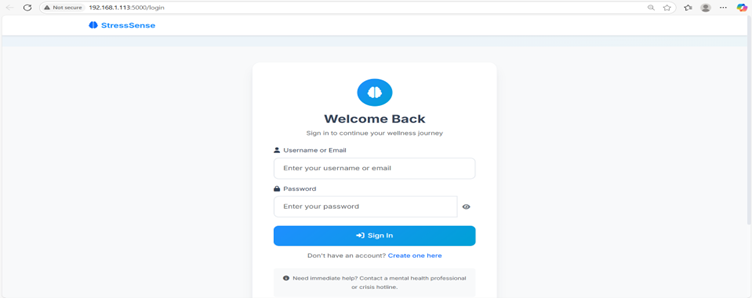
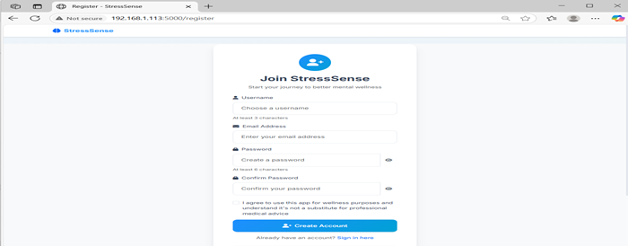
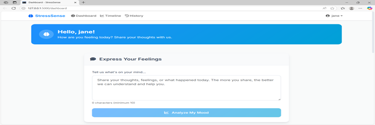
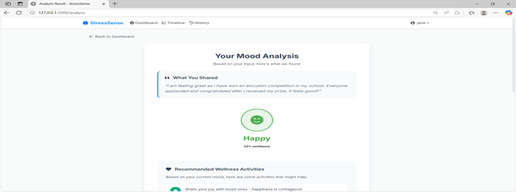
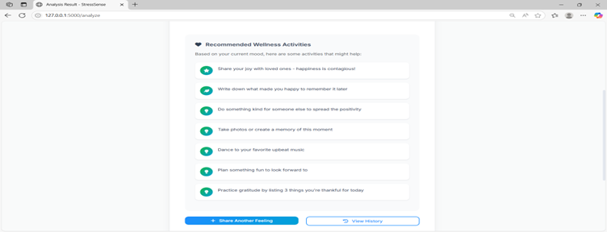

# StressSense - Mental Health & Wellness App

A Flask-based mental health web application that detects stress levels from text input using machine learning and provides personalized wellness activity recommendations.

## Features

- 🧠 **AI-Powered Emotion Detection**: Uses machine learning to analyze text and detect emotions (happy, sad, angry, anxious, stressed, neutral)
- 📊 **Interactive Timeline Visualization**: Beautiful charts showing your emotional journey over time
- 👤 **User Authentication**: Secure registration and login system
- 🎯 **Personalized Recommendations**: Get tailored wellness activities based on your current mood
- 📱 **Responsive Design**: Works perfectly on desktop and mobile devices
- 📈 **Emotion Tracking**: Track your emotional patterns and trends
- 🎨 **Modern UI**: Clean, professional interface focused on mental wellness

## Screenshots


### Login Page


### Registration Page



### Dashboard


### Output



The app includes:
- Beautiful dashboard for mood analysis
- Interactive timeline with Chart.js visualizations
- Emotion distribution charts
- Personalized wellness activity recommendations
- User-friendly authentication system

## Installation & Setup

### Prerequisites

- Python 3.8 or higher
- pip (Python package installer)

### Local Installation

1. **Download all files** to a new folder on your computer

2. **Install Python dependencies**:
   ```bash
   pip install -r local_requirements.txt
   ```

3. **Set environment variables** (optional but recommended):
   ```bash
   # On Windows
   set SESSION_SECRET=your-secret-key-here
   set DATABASE_URL=sqlite:///stresssense.db

   # On Mac/Linux
   export SESSION_SECRET=your-secret-key-here
   export DATABASE_URL=sqlite:///stresssense.db
   ```

4. **Run the application**:
   ```bash
   python main.py
   ```

5. **Open your browser** and go to:
   ```
   http://localhost:5000
   ```

### Alternative Running Methods

**Using Flask directly**:
```bash
flask --app main run --debug
```

**Using Gunicorn** (for production):
```bash
gunicorn --bind 0.0.0.0:5000 main:app
```

## Usage

1. **Register** a new account or login with existing credentials
2. **Analyze your mood** by entering text describing how you feel
3. **View recommendations** based on your detected emotion
4. **Check the timeline** to see your emotional trends over time
5. **Browse history** to review past analyses

## Project Structure

```
stresssense/
├── app.py                 # Flask app configuration
├── main.py               # Application entry point
├── models.py             # Database models
├── routes.py             # Application routes
├── emotion_model.py      # ML emotion detection
├── train_model.py        # Model training script
├── data/
│   └── emotion_dataset.csv    # Training data
├── static/
│   ├── css/
│   │   └── style.css     # Custom styles
│   └── js/
│       └── main.js       # JavaScript utilities
├── templates/
│   ├── base.html         # Base template
│   ├── login.html        # Login page
│   ├── register.html     # Registration page
│   ├── dashboard.html    # Main dashboard
│   ├── result.html       # Analysis results
│   ├── timeline.html     # Timeline visualization
│   └── history.html      # History page
└── local_requirements.txt # Python dependencies
```

## Technology Stack

- **Backend**: Flask, SQLAlchemy, Flask-Login
- **Frontend**: Bootstrap 5, Chart.js, Font Awesome
- **Machine Learning**: scikit-learn, pandas, numpy
- **Database**: SQLite (default) or PostgreSQL
- **Styling**: Custom CSS with modern design

## Machine Learning Model

The emotion detection uses:
- **TF-IDF Vectorization** for text feature extraction
- **Logistic Regression** for classification
- **6 Emotion Categories**: happy, sad, angry, anxious, stressed, neutral
- **Training Data**: 110+ labeled text samples

## Customization

### Adding New Emotions

1. Add new emotion data to `data/emotion_dataset.csv`
2. Update emotion colors in `emotion_model.py`
3. Add activity recommendations for the new emotion
4. Retrain the model by deleting `model.pkl` and restarting

### Styling Changes

- Modify `static/css/style.css` for visual customization
- Update color variables in the CSS `:root` section
- Customize Bootstrap components as needed

## Database

- **Default**: SQLite database (`stresssense.db`)
- **Production**: Set `DATABASE_URL` environment variable for PostgreSQL
- **Tables**: Users and EmotionLog with proper relationships

## Security Features

- Password hashing with Werkzeug
- Session management with Flask-Login
- CSRF protection ready
- Environment variable configuration

## Troubleshooting

**Common Issues:**

1. **Import errors**: Make sure all dependencies are installed
   ```bash
   pip install -r local_requirements.txt
   ```

2. **Database errors**: Delete `stresssense.db` to reset the database

3. **Port already in use**: Change the port in `main.py`:
   ```python
   app.run(host='0.0.0.0', port=5001, debug=True)
   ```

4. **Model training issues**: The app will automatically train the model on first run


## Disclaimer

This application is for wellness purposes only and is not a substitute for professional medical advice, diagnosis, or treatment. If you're experiencing mental health issues, please consult with a qualified healthcare provider.

## License

This project is for educational and personal use. Please respect mental health and use responsibly.
✅ You may use, study, and modify the code for learning or personal wellness projects.

❌ You may not use this project for commercial purposes or redistribute it without permission.

🔒 Please respect the purpose and sensitivity of mental health applications.

---

